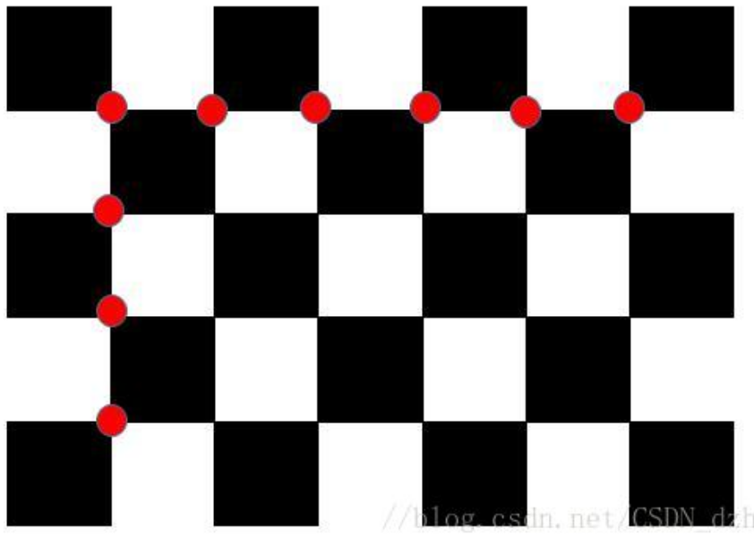

## OpenCV C++ Monocular Camera Calibration

This repository contains some sources to calibrate the intrinsics of individual cameras and also the extrinsics of images

### Dependencies

- OpenCV

### Compilation

Compile all the files using the following commands.

```bash
mkdir build && cd build
cmake ..
make
```
Make sure your are in the `build` folder to run the executables.


### Intrnsic calibration of camera

Once you have compiled the sources run the following command to calibrate the intrinsics.


```bash
./calib [chessboard_width] [chessboard_height] [imgs_directory] [file_extension]
```

The parameters `chessboard_width` and `chessboard_height` don't mean the cols and rows of chessboard, it means internal corners of each rows and cols.

The `chessboard_width = 6` and `chessboard_height = 4` for the belowing chessboard. But, in practice, you can change the width and height, which will not affect the calibration results.
 


For example, the command for the test images in ./calib_imgs/1/ would be
```bash
./calib 6 9 ../calib_imgs/1 jpg
```
and the command for the test images in ./calib_imgs/2/ would be

```bash
./calib 7 7 ../calib_imgs/2 jpg
```


